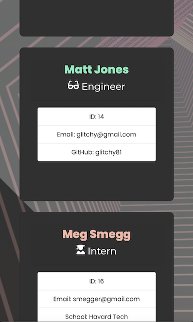

<!-- Readme top-->
<a name="readme-top"></a>

<!-- Project shields -->
<span style="display:block" align="center" class="shields">

[![Stargazers][stars-shield]][stars-url]
[![Issues][issues-shield]][issues-url]
[![License][license-shield]][license-url]
[![LinkedIn][linkedin-shield]][linkedin-url]

</span>

<!-- Readme Header -->
<div align="center">
	
</div>
<br>

<!-- project title -->
#
<h2 align="center">"CodeBoss: The Ultimate Tech Manager's Team Builder CLI program</h2>


<div align="center">
<p>A handy command line interface application that allows a team manager to build a team of employees, edit, view or remove them and finally render them to an html page and a data.json.</p>
<a href="https://github.com/Matt-Jones-Developer/codeboss_engineer_dashboard/"><strong>Explore the docs »</strong></a>
<br />
<br />
<a href="https://github.com/Matt-Jones-Developer/codeboss_engineer_dashboard/">View Project</a>
·
<a href="https://github.com/Matt-Jones-Developer/codeboss_engineer_dashboard/issues">Report Bug</a>
·
<a href="https://github.com/Matt-Jones-Developer/codeboss_engineer_dashboard/issues">Request Feature</a>
·
<a href="https://github.com/matt-jones-developer?tab=repositories">Check out my work</a>
·
</div>
<br>
<!-- gif -->
<div align="center">
  
</div>

#

## Table of Contents

* [Description](#description)
* [Installation](#installation)
* [Usage](#usage)
* [Tests](#tests)
* [Contributing](#contributing)
* [License](#license)
* [Questions](#questions)
#

<!-- about the project -->
## Project Summary

CodeBoss - an exciting CLI program for tech managers to build a team of employees that saves to an html file and a json for company data use. 

Makes use of classes, inheritance, inquirer prompts, a custom main menu interface with built in ascii and typewriter functions, as well as manager tools and utility function scripts.  

Easily build a team of employees that are editable and will output an html file and json data file to the output folder.
#
### Motivation

I wanted to create a program that made it easy for team managers to quickly generate an html web page and a bonus json file for data collecting that was enjoyable to use, fully interactive and rendered the team to file. 
#
### Challenges

Initially I wanted to add setters and getters to each class, that allowed containment of all the various functions relevant to each employee type.  

I then decided to keep the classes as blueprints only, then create a createEmployee function that dealt with prompts and instantiated each team member as they were created.  

I developed clean modularised scripts that dealt with all the functions required by the manager such as an ability to change the manager, remove the team to start over, view current team and plenty of simple and useful utilities such as capitalising names and schools, auto reading and writing to json and other [TODO] utilities like checking if a manager existed - as to allow for re-use of a previous team build, should they want to continue from a previous session.  

I ran out of time so these other features have been ice-boxed and will be developed in future builds.  I learnt a lot about async await, how to build a menu interface, particularly new Promise, resolve and reject, setting timeouts and I was also quite proud of the displayMessage functions that allow the logs to not interfere with the main menu and vice versa. 

Really enjoyed overcoming all of the issues and confusion along the way and feel that my final scripts show my Javascript skills are starting to level up.
#
### Unique Selling Points

My builds USP’s are that the interface is advanced, fun to use and has some nice touches such as ascii titles (each are their own function calls), the type to text function and the professional quality of the rendered html file.  

The addition of a json file that would be useful for company data and processing for larger teams is a nice feature too, however I still have work to do on that!  My icebox for this project has plenty of future updates incoming!

#


<p align="right">(<a href="#readme-top">back to top</a>)</p>


## Installation

To use this app, you can clone the project - I will need to be accredited as it’s under an Apache license.  

### Installation Instructions

You must install npm:

```
npm i
```
then initialise npm:

```
npm init -y
```
Next, grab Node (install and use nvm for this):

```
curl -o- https://raw.githubusercontent.com/creationix/nvm/v0.33.11/install.sh | bash
```
```
command -v nvm
```
```
nvm install node
```
confirm success:
```
npm -v
```
Finally, install all the dependencies used:
```
npm i inquirer@^8.2.5
```
Repeat the last step to also install:
```
  "figlet": "^1.5.2",
  "jest": "^29.4.3",
  "moment": "^2.29.4",
  "open": "^8.4.2",
  "readline": "^1.3.0",
  "url": "^0.11.0"
```
The app can be run by typing ‘node index.js’.  

Your final html and json files are written to the output folder along with a pre-styled CSS file.

## Usage

Quickly build and manage your team via a main menu interface.  Ability to change manager, edit, view or remove team and build to write the team to an html and json file.  


View the CLI program screenshots below:

<div align="center">

  [![Product Name Screen Shot][product-screenshot]](https://github.com/Matt-Jones-Developer/codeboss_engineer_dashboard)

  [![Product Name Screen Shot][product-screenshot-2]](https://github.com/Matt-Jones-Developer/codeboss_engineer_dashboard)

  [![Product Name Screen Shot][product-screenshot-3]](https://github.com/Matt-Jones-Developer/codeboss_engineer_dashboard)

  [![Product Name Screen Shot][product-screenshot-4]](https://github.com/Matt-Jones-Developer/codeboss_engineer_dashboard)

</div>
<br>

<br>
<!-- video of finished product -->
<div align="center">
  <h2>A demo of the rendered output file:</h2>
  
</div>

Screenshot of the programs output with
fully responsive design:

![tablet-screenshot1]

<!-- centered images -->
<div align="center">
<!-- ![mobile-screenshot1] ![mobile-screenshot2] -->
  
  
</div>


<p align="right">(<a href="#readme-top">back to top</a>)</p>

## Tests

Jest was used for all testing.  If you run:
```
npm run test 
```
You will see that each test for the classes will pass.


## Contributing

If you’d like to contributor or improve this program, please get in touch below.  It is not open-source and if cloned will need to accredit my name within your projects readme and adhere to the license conditions and requirements.

<p align="right">(<a href="#readme-top">back to top</a>)</p>


#
## License

This project is licensed under the terms of the Apache 2.0 license.

For more information, please visit this link: [Apache 2.0](https://choosealicense.com/licenses/apache-2.0/)


#
## Questions

For questions or concerns, please contact [matt-jones-developer](https://github.com/Matt-Jones-Developer/codeboss_engineer_dashboard) via Github.

###  Other contacts:

You can also reach me via the following: 👻💬

📪 [Email](glitchyghost81@gmail.com) · 💻 [LinkedIn](https://www.linkedin.com/in/matt-jones-zx81) · 👾 [Twitter](glitchy81) · 👻 [Slack](mattjones) · 🤡 [Instagram](glitchy) 

<p align="right">(<a href="#readme-top">back to top</a>)</p>

#

## Deployment & Repo links:

Project Repo Link: [https://github.com/Matt-Jones-Developer/codeboss_engineer_dashboard](https://github.com/Matt-Jones-Developer/codeboss_engineer_dashboard)

Deployed Project Link: [https://github.com/Matt-Jones-Developer/codeboss_engineer_dashboard](N/A)

# 
## Acknowledgments

Thanks to my tutor Wesley Clements for educating me (in depth) about how reject and resolve work behind the scenes and how to use them in conjunction with async await - helped my ascii's and main menu play nicely! Cheers!

Thanks to [Marc Hudson](https://github.com/marcahudson26) for demo'ing his version of the 'type to text' effect to me, which I then decided to cheekily borrow and code my own version of (my code is unique and achieved the same result, differently) 
Cheers fellow peer, you're a coding legend Sir!

#
<br>
<h3>How was this readme created?!
<h3 align="left">Built with <a href="https://github.com/Matt-Jones-Developer/speedme_that_readme_generator/">SPEEDME</a>: The ultimate README generator!</h3>


[stars-shield]: https://img.shields.io/github/stars/matt-jones-developer/codeboss_engineer_dashboard.svg?style=for-the-badge
[stars-url]: https://github.com/Matt-Jones-Developer/codeboss_engineer_dashboard/stargazer
[issues-shield]: https://img.shields.io/github/issues/matt-jones-developer/codeboss_engineer_dashboard.svg?style=for-the-badge
[issues-url]: https://github.com/Matt-Jones-Developer/codeboss_engineer_dashboard/issues
[license-shield]: https://img.shields.io/github/license/matt-jones-developer/codeboss_engineer_dashboard.svg?style=for-the-badge
[license-url]: https://github.com/Matt-Jones-Developer/codeboss_engineer_dashboard/blob/main/LICENSE
[linkedin-shield]: https://img.shields.io/badge/-LinkedIn-black.svg?style=for-the-badge&logo=linkedin&colorB=555
[linkedin-url]: https://www.linkedin.com/in/matt-jones-zx81

[product-screenshot]: ./src/img/screenshots/product_screenshot.png
[product-screenshot-2]: ./src/img/screenshots/product_screenshot_2.png
[product-screenshot-3]: ./src/img/screenshots/product_screenshot_3.png
[product-screenshot-4]: ./src/img/screenshots/product_screenshot_4.png

[console-output-screenshot]: ./src/img/screenshots/console_output.png
[console-output-screenshot-2]: ./src/img/screenshots/console_output_2.png
[tablet-screenshot1]: ./src/img/screenshots/tablet_screenshot.png
[mobile-screenshot1]: ./src/img/screenshots/mobile_screenshot_1.png
[mobile-screenshot2]: ./src/img/screenshots/mobile_screenshot_2.png

